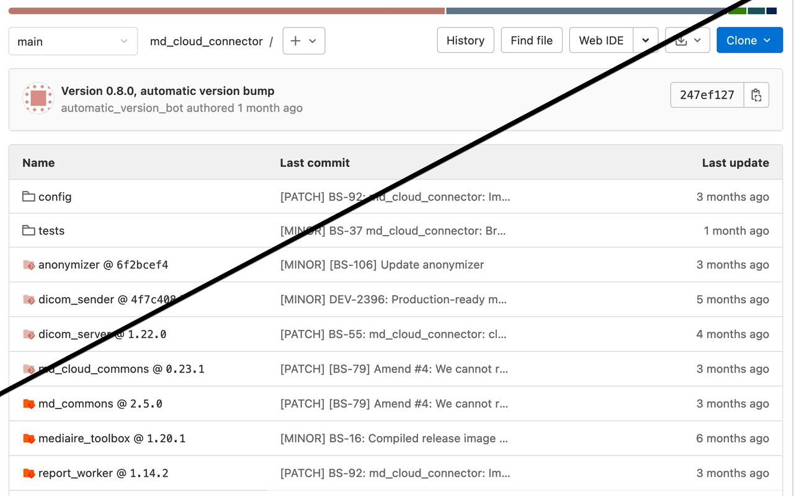

# Gitlab Submodule Tags Browser Extension
Show target tag names instead of commit hashes for submodules in Gitlab.

## Development
Load the extension via `about:debugging` as described
[here][mozilla_first_extension].

### Installation
_Unfortunately this [does not work][mozilla_addon_signing] in the branded
Release versions of Firefox._

1. Turn off signature verification for extensino installs (and be aware of the
   associated risks): in `about:config` set `xpinstall.signatures.requred` to
   `false`.
2. Create a packaged extension `gitlab-submodules-tags-extension.zip` using
   `make extension`.
3. Drag the ZIP file into `about:addons`

## Icon
The icon is composed of the Gitlab [file type icon][gitlab_icon_filetype]
`folder-git` and the UI icon [`label`][gitlab_icon_label].

## TODO
- Gitlab API pagingation (currently only works if the checked out commit is in
  the latest 100 commits)
- If possible, find the associated branch name as well
- diff views
- Port to manifest v3

[mozilla_first_extension]: https://developer.mozilla.org/en-US/docs/Mozilla/Add-ons/WebExtensions/Your_first_WebExtension#trying_it_out
[mozilla_addon_signing]: https://support.mozilla.org/en-US/kb/add-on-signing-in-firefox#w_what-are-my-options-if-i-want-to-use-an-unsigned-add-on-advanced-users
[gitlab_icon_label]: https://gitlab-org.gitlab.io/gitlab-svgs/?q=~label
[gitlab_icon_filetype]: https://gitlab.com/gitlab-org/gitlab/-/tree/master/app/assets/images/file_icons.svg
